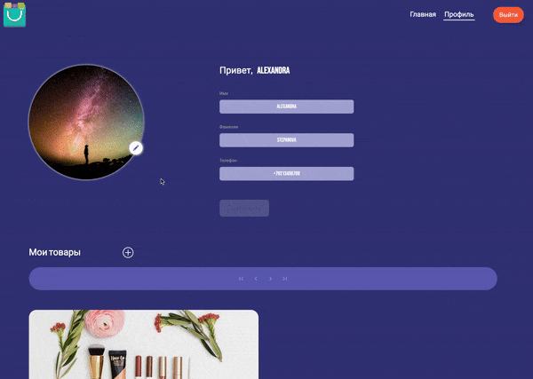
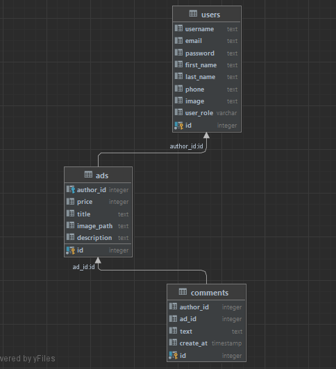

## ADS-online

## Проект платформы по перепродаже вещей

## Бэкенд-часть проекта предполагает реализацию следующего функционала:

- Авторизация и аутентификация пользователей.

- Распределение ролей между пользователями: пользователь и администратор.

- CRUD для объявлений на сайте: администратор может удалять или редактировать все объявления, а пользователи — только свои.

- Под каждым объявлением пользователи могут оставлять отзывы.

- В заголовке сайта можно осуществлять поиск объявлений по названию.

- Показывать и сохранять картинки объявлений.

## Спецификация

Установка и запуск образа фронтэнд-части в Docker: 

docker run --rm -p 3000:3000 ghcr.io/bizinmitya/front-react-avito:v1.17

## Использован следующий стек технологий: 

Java11\
SpringBoot\
Swagger\
Hibernate\
PostgreSQL\
Lombok\
JUnit\
Mockito\
Maven\
Liquibase\
Security\
Docker

## Структура базы данных: 

## Development 
Богатырь Ирина 
